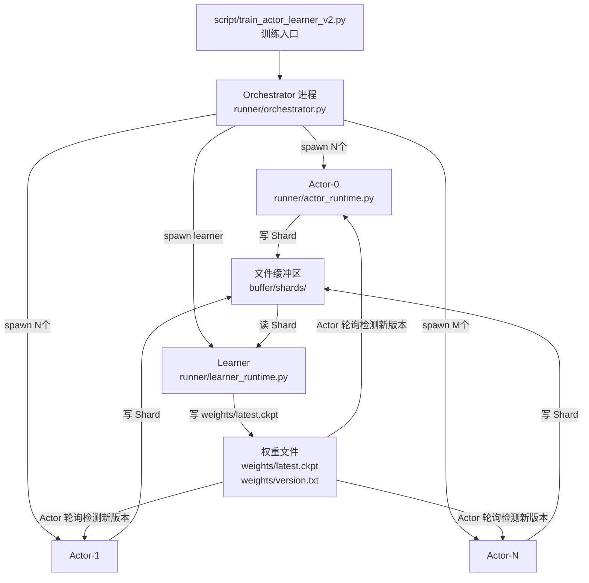
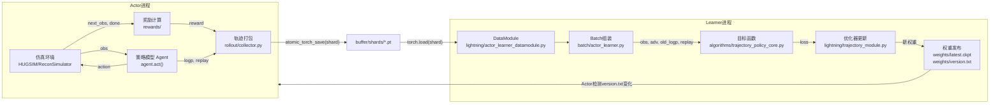
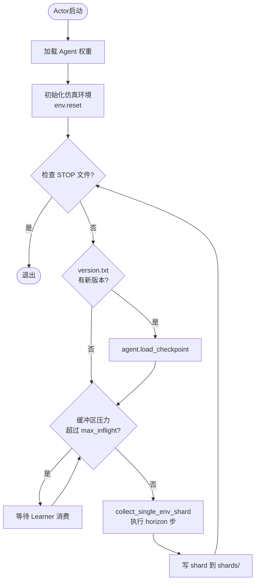
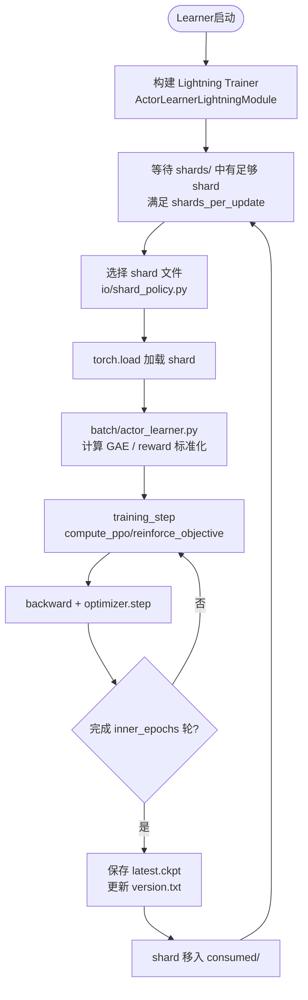
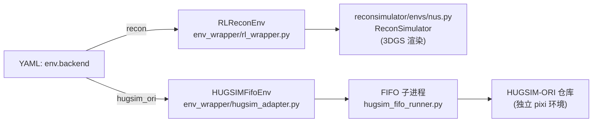
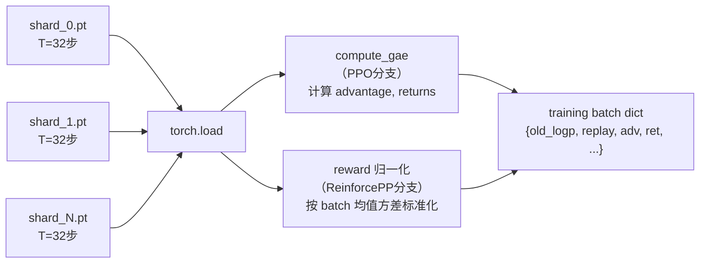
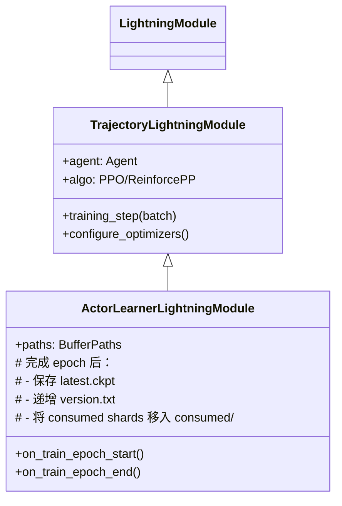
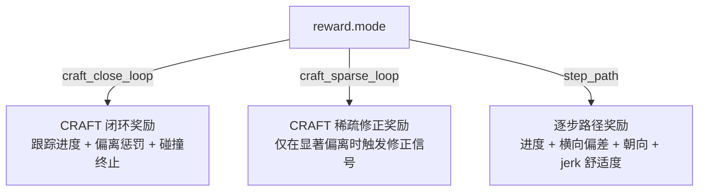
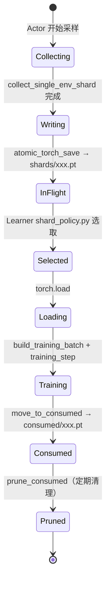
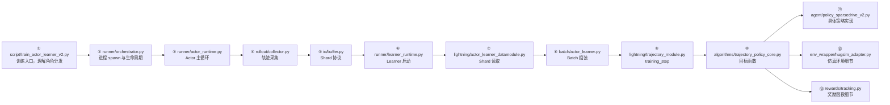

# ReconDiff 技术文档

> 面向新读者的深入浅出代码框架导读

---

## 目录

1. [项目简介](#1-项目简介)
2. [整体架构一览](#2-整体架构一览)
3. [训练主链路详解](#3-训练主链路详解)
4. [核心模块深度解析](#4-核心模块深度解析)
   - 4.1 [训练入口与进程编排（runner）](#41-训练入口与进程编排runner)
   - 4.2 [策略适配层（agent）](#42-策略适配层agent)
   - 4.3 [环境包装层（env_wrapper）](#43-环境包装层env_wrapper)
   - 4.4 [轨迹采集层（rollout）](#44-轨迹采集层rollout)
   - 4.5 [文件缓冲区通信（io）](#45-文件缓冲区通信io)
   - 4.6 [Batch 构建（batch）](#46-batch-构建batch)
   - 4.7 [算法目标函数（algorithms）](#47-算法目标函数algorithms)
   - 4.8 [训练调度层（lightning）](#48-训练调度层lightning)
   - 4.9 [奖励计算（rewards）](#49-奖励计算rewards)
5. [Shard 生命周期详解](#5-shard-生命周期详解)
6. [配置系统](#6-配置系统)
7. [推荐阅读顺序](#7-推荐阅读顺序)
8. [常见概念词汇表](#8-常见概念词汇表)

---

## 1. 项目简介

ReconDiff（原名 ReconDreamer-RL）是一个**自动驾驶闭环强化学习训练框架**。它将以下几块整合在一起：

| 模块 | 作用 |
|------|------|
| 策略模型 | SparseDriveV2 / DiffusionDriveV2 等驾驶决策网络 |
| 仿真环境 | 基于 3DGS（3D Gaussian Splatting）渲染的 nuScenes 真实场景 |
| RL 算法 | PPO、ReinforcePP（含可选 GRPO 分支） |
| 奖励函数 | CRAFT 轨迹跟踪、闭环评估（EA）、碰撞惩罚 |
| 评估管线 | 训练后自动触发 HUGSIM-ORI 评估 |

**核心思路**：Actor 进程在仿真环境中采集轨迹（Rollout）→ 写入文件缓冲区（Shard）→ Learner 进程读取并更新策略权重 → 权重发布给 Actor 继续采样，形成闭环。

---

## 2. 整体架构一览

### 2.1 进程角色



### 2.2 顶层目录结构

```
ReconDiff/
├── script/                  # 训练入口脚本 & YAML 配置
│   ├── train_actor_learner_v2.py   # 主入口
│   ├── train_eval_pipeline.py      # 训练+自动评估管线
│   └── configs/                   # 分模型的 YAML 配置目录
│
├── framework/               # 核心 RL 框架（主体代码）
│   ├── runner/              # 进程编排 & 运行时入口
│   ├── agent/               # 策略模型适配层
│   ├── env_wrapper/         # 仿真环境包装（Gymnasium 风格接口）
│   ├── rollout/             # Actor 侧轨迹采集
│   ├── io/                  # 文件缓冲区协议（shard / weights / stop）
│   ├── batch/               # shard → 训练 batch 转换
│   ├── algorithms/          # PPO / ReinforcePP 目标函数
│   ├── lightning/           # PyTorch Lightning 训练调度
│   ├── rewards/             # 奖励函数实现
│   ├── rewardmodel/         # 学习型奖励模型（JEPA 风格）
│   └── utils/               # 工具：gsplat 预热、路径、观测预处理
│
├── reconsimulator/          # 3DGS 渲染仿真环境（ReconDreamer fork）
│   ├── envs/                # nuScenes 环境变体
│   └── render/              # 渲染模型、数据集、配置
│
├── policy/                  # 部署侧策略包装（人工基线）
├── tests/                   # pytest 测试套件
└── tools/                   # 独立工具脚本
```

---

## 3. 训练主链路详解

### 3.1 完整数据流



### 3.2 Actor 内部工作循环



### 3.3 Learner 工作流程（Epoch 循环）



---

## 4. 核心模块深度解析

### 4.1 训练入口与进程编排（runner）

**文件**: `script/train_actor_learner_v2.py`, `framework/runner/`

#### 启动流程

用户执行：
```bash
PYTHONPATH=/cv/rl_wm/ReconDiff python script/train_actor_learner_v2.py \
  --role orchestrator \
  --config script/configs/sparsedrive_v2/xxx.yaml
```

入口 `main()` 解析 `--role` 参数：

| role | 执行函数 | 说明 |
|------|----------|------|
| `orchestrator` | `orchestrator_main()` | 父进程，spawn Actor/Learner |
| `actor` | `actor_main()` | 采样进程 |
| `learner` | `learner_main()` | 训练进程 |

#### Orchestrator 做了什么？

```python
# framework/runner/orchestrator.py
def orchestrator_main(cfg, config_path):
    # 1. 解析 actor/learner 的 GPU 分配
    actor_gpu_plan = resolve_actor_gpu_ids(al_cfg, num_actors)
    learner_gpu_ids = resolve_learner_gpu_ids(al_cfg)

    # 2. 预热 gsplat CUDA 扩展（避免 Actor 重复编译）
    warmup_gsplat_cuda(py, env=launch_env)

    # 3. 用 subprocess.Popen spawn Learner
    learner_procs = [Popen(cmd) for cmd in learner_specs]

    # 4. 依次 spawn 所有 Actor
    actor_procs = [Popen(actor_cmd) for actor_cmd in actor_cmds]

    # 5. 主循环：轮询 Learner 退出 → 触发 STOP 文件 → 清理子进程
    while True:
        if learner_exited: break
        if actor_crashed: write_actor_failure(...)
        time.sleep(2.0)
```

**关键设计**：Orchestrator 是纯调度进程，它写 STOP 文件来优雅终止所有子进程。

#### 关键工厂函数

| 文件 | 用途 |
|------|------|
| `runner/agent_factory.py` | `build_agent(cfg)` → 返回对应策略的 Agent 实例 |
| `runner/env_factory.py` | `build_actor_env(cfg)` → 返回封装好的仿真环境 |
| `runner/learner_factory.py` | 构建 PPO/ReinforcePP 算法对象和 value net |
| `runner/config_normalization.py` | 规范化 YAML 字段，填充默认值 |

---

### 4.2 策略适配层（agent）

**文件**: `framework/agent/`

#### Agent 基类接口

```python
# framework/agent/base.py
class Agent:
    def act(self, observation) -> (action, logp, replay):
        """采样一步动作，返回动作、log概率、重算所需数据"""

    def act_batch(self, observations) -> (actions, logps, replays):
        """批量采样"""

    def logp_from_replay(self, replay, eta) -> Tensor:
        """在当前参数下，重算 replay 中保存动作的 log 概率"""
        # 这是 RL 更新时必须调用的接口！

    def save_checkpoint(self, path): ...
    def load_checkpoint(self, path): ...
```

**为什么需要 `replay`？** PPO/ReinforcePP 要求 importance sampling，必须知道 **采样时的 logp**（old_logp）和在**当前参数**下的 logp（new_logp），因此 Actor 必须把计算 logp 所需的中间量（`replay` dict）打包进 shard，Learner 侧再调用 `logp_from_replay` 重算。

#### 具体实现

| 文件 | 策略模型 | 说明 |
|------|----------|------|
| `policy_sparsedrive_v2.py` | SparseDriveV2 | 当前主用，扩散模型策略 |
| `policy_sparsedrive.py` | SparseDrive | 老版本 |
| `policy_diffusiondrivev2.py` | DiffusionDriveV2 | 另一套扩散驾驶策略 |
| `policy_dummy.py` | 虚拟 Agent | 测试/调试用 |

---

### 4.3 环境包装层（env_wrapper）

**文件**: `framework/env_wrapper/`

#### 两种仿真后端



#### RLReconEnv（Recon 后端）

`env_wrapper/rl_wrapper.py` 将 `ReconSimulator` 包装为 Gymnasium 接口：
- `reset()` → 重置场景，返回 `(obs, info)`
- `step(action)` → 执行动作，返回 `(next_obs, reward, terminated, truncated, info)`
- **观测**：6路环视相机图像 + 自车状态（位置、朝向、速度）+ 地图信息
- **动作**：`(x, y, yaw, flag)` 目标位姿

#### HUGSIMFifoEnv（HUGSIM 后端）

通过 FIFO 管道与 HUGSIM-ORI 子进程通信：

```mermaid
sequenceDiagram
    participant Actor as Actor进程
    participant Adapter as hugsim_adapter.py
    participant Runner as hugsim_fifo_runner.py(子进程)
    participant HUGSIM as HUGSIM-ORI(pixi环境)

    Actor->>Adapter: env.reset()
    Adapter->>Runner: 写 reset 命令到 FIFO
    Runner->>HUGSIM: 调用 HUGSIM API
    HUGSIM->>Runner: 返回 obs
    Runner->>Adapter: 写 obs 到 FIFO
    Adapter->>Actor: 返回标准化后的 obs

    Actor->>Adapter: env.step(action)
    Adapter->>Runner: 写 action 到 FIFO
    Runner->>HUGSIM: 执行 step
    HUGSIM->>Runner: 返回 next_obs, reward_info
    Runner->>Adapter: 写结果到 FIFO
    Adapter->>Actor: 返回 (obs, reward, done, info)
```

**HUGSIM 对齐**：`hugsim_recon_alignment.py` 负责把 HUGSIM 坐标系的目标框、自车位姿转换到 Recon 坐标系，让奖励函数可以统一处理。

---

### 4.4 轨迹采集层（rollout）

**文件**: `framework/rollout/collector.py`

Actor 调用 `collect_single_env_shard()` 执行 `horizon` 步采样：

```python
def collect_single_env_shard(env, agent, obs, horizon, ...):
    steps = []
    for t in range(horizon):
        # 1. 策略采样动作
        action, logp, replay = agent.act(obs, eta=eta)

        # 2. 环境执行
        next_obs, reward, terminated, truncated, info = env.step(action)

        # 3. 存储这一步
        steps.append({
            "obs": obs,
            "action": action,
            "logp": logp,        # 采样时的对数概率
            "replay": replay,    # Learner 重算 logp 所需数据
            "reward": reward,
            "done": terminated or truncated,
            "info": info,
        })

        if terminated or truncated:
            obs, _ = env.reset()
        else:
            obs = next_obs

    # 4. 打包成 shard dict
    shard = package_shard(steps, meta={...})
    return shard, obs, info
```

**Shard 数据结构**：

```python
shard = {
    "obs": [...],          # 各步观测（可选，PPO需要，ReinforcePP不需要）
    "actions": [...],      # 各步动作
    "logps": Tensor,       # 各步 old_logp（采样时计算）
    "replays": [...],      # 各步 replay dict（用于重算 logp）
    "rewards": Tensor,     # 各步奖励
    "dones": Tensor,       # 各步终止标志
    "meta": {              # 元信息
        "actor_id": 0,
        "version": 5,      # 采样时的权重版本
        "timing": {...},   # 各阶段耗时
        "reward_summary": {...},  # 奖励统计
    }
}
```

---

### 4.5 文件缓冲区通信（io）

**文件**: `framework/io/buffer.py`

Actor 和 Learner 通过共享文件系统通信（不使用网络，无需 gRPC/Redis）：

#### 目录结构

```
buffer_dir/               (e.g. outputs/actor_learner/20260603_xxx/)
├── buffer/
│   ├── shards/           # Actor 写入的新 shard
│   │   └── actor0_e0_v5_t1234567890_abc12345.pt
│   └── consumed/         # Learner 消费后移入此处
├── weights/
│   ├── latest.ckpt       # 最新权重
│   └── version.txt       # 当前版本号（整数）
├── actors/               # Actor 心跳文件
├── STOP                  # 存在即触发停止
└── TRAINING_LOCK         # Learner 训练期间存在，Actor 暂停采样
```

#### 关键操作

```python
# 原子写 shard（防止 Learner 读到不完整文件）
atomic_torch_save(shard, path)   # 先写 .tmp，再 os.replace

# Actor 轮询新版本
cur_ver = read_int(paths.version_file)
if cur_ver > local_ver:
    agent.load_checkpoint(paths.latest_ckpt)

# 背压控制
count_inflight(paths, actor_id)  # 统计 shards/ 中该 actor 的文件数
# 超过 max_inflight 则等待

# 停止信号
stop_requested(paths)  # 检查 STOP 文件是否存在
```

---

### 4.6 Batch 构建（batch）

**文件**: `framework/batch/actor_learner.py`

Learner 从多个 shard 组装成训练 batch：



**PPO vs ReinforcePP 的关键区别**：

| | PPO | ReinforcePP |
|---|-----|-------------|
| 优势估计 | GAE（需要 value net） | 归一化 reward（无需 value net） |
| obs 是否存入 shard | 视配置（critic 用 agent features 时可省） | 不需要 |
| 损失函数 | policy loss + value loss | policy loss only |

---

### 4.7 算法目标函数（algorithms）

**文件**: `framework/algorithms/trajectory_policy_core.py`

#### PPO 目标函数

```
PPO 损失 = -E[ min(ratio * adv, clip(ratio, 1-ε, 1+ε) * adv) ]
其中 ratio = exp(new_logp - old_logp)
```

```python
def compute_ppo_objective(batch, agent, algo, device):
    old_logp = batch["logps"]
    new_logp = agent_logp_from_replay_batch(agent, batch["replays"])

    ratio = (new_logp - old_logp).exp()
    adv = batch["advantages"]       # 来自 GAE

    # 裁剪 ratio
    surr1 = ratio * adv
    surr2 = ratio.clamp(1-ε, 1+ε) * adv
    policy_loss = -torch.min(surr1, surr2).mean()

    # Value 损失
    value_pred = value_net(features)
    value_loss = F.mse_loss(value_pred, batch["returns"])

    return policy_loss + vf_coef * value_loss
```

#### ReinforcePP 目标函数

```
ReinforcePP = REINFORCE + ratio 裁剪（不需要 value net）
```

```python
def compute_reinforce_objective(batch, agent, algo, device):
    old_logp = batch["logps"]
    new_logp = agent_logp_from_replay_batch(agent, batch["replays"])

    ratio = (new_logp - old_logp).exp()
    adv = batch["advantages"]       # 来自归一化奖励

    # 带裁剪的 REINFORCE
    surr1 = ratio * adv
    surr2 = ratio.clamp(1-ε, 1+ε) * adv
    policy_loss = -torch.min(surr1, surr2).mean()

    # 可选：KL 散度正则 / 知识蒸馏损失
    return policy_loss + kl_coef * kl_loss
```

#### GRPO 扩展

ReinforcePP 可以额外叠加 GRPO（Group Relative Policy Optimization）：
- 从同一场景采样多条轨迹候选
- 用 CRAFT scorer 对每条轨迹打分
- 将相对排名作为额外优势信号

---

### 4.8 训练调度层（lightning）

**文件**: `framework/lightning/`

#### 类继承关系



#### training_step 内部流程

```python
def training_step(self, batch, batch_idx):
    if algo == "ppo":
        loss, metrics = compute_ppo_objective(batch, agent, algo, device)
    elif algo == "reinforcepp":
        loss, metrics = compute_reinforce_objective(batch, agent, algo, device)

    # 可选：知识蒸馏损失
    if forward_kl_coef > 0 or reverse_kl_coef > 0:
        kl_metrics = compute_distillation_metrics(...)
        loss += kl_loss

    # WandB 日志
    self.log_dict(metrics)
    return loss
```

---

### 4.9 奖励计算（rewards）

**文件**: `framework/rewards/`

奖励函数支持多种模式，由 YAML `env.reward.mode` 字段选择：



#### CRAFT 闭环奖励（craft_close_loop，主要模式）

```
reward = w_g * progress_reward
       + w_c * center_deviation_penalty
       + w_h * heading_penalty
       - cost_off_road * off_road_flag
       - cost_red_light * red_light_flag
       - term_collision * collision_flag  (终止惩罚)
       - term_route_dev * route_dev_flag  (终止惩罚)
```

**Safety Gate**：当检测到碰撞或严重横向/朝向偏差时，正向奖励被屏蔽（gate = 0），只保留惩罚项，防止策略在危险状态下仍获正向激励。

---

## 5. Shard 生命周期详解



**背压控制**：Actor 计算 `count_inflight(shards/)` 中自己文件数量，超过 `max_inflight_per_actor` 则等待，防止磁盘爆满。

**版本滞后过滤**：`io/shard_policy.py` 会过滤掉 `version < current_version - max_shard_version_lag` 的 shard，避免 Learner 用过老的数据训练。

---

## 6. 配置系统

**文件**: `script/configs/`, `framework/runner/config_normalization.py`

YAML 配置分四大块：

```yaml
env:           # 仿真环境参数
  backend: hugsim_ori        # 后端选择
  max_steps: 36              # 每 episode 最大步数
  reward:
    mode: craft_close_loop   # 奖励模式

train:         # 训练超参数
  algo: reinforcepp          # 算法选择
  policy_lr: 3e-6
  clip_eps: 0.2
  actor_learner:             # actor-learner 协调参数
    num_actors: 24           # Actor 进程数
    actor_horizon: 32        # 每 shard 步数
    shards_per_update: 24    # 每次更新消费的 shard 数
    learner_gpu_ids: [0, 1]  # Learner GPU
    actor_gpu_pool: [2,3,4,5,6,7]  # Actor GPU 池

agent:         # 策略模型参数
  type: sparsedrive_v2
  ckpt: path/to/pretrained.ckpt
  trainable_prefixes: []     # 可训练模块前缀
  frozen_prefixes: [_backbone]  # 冻结模块前缀

# （可选）rewardmodel:  学习型奖励模型配置
```

**配置规范化**：`config_normalization.py` 会补全缺省值、解析 GPU ID 列表、推算 `num_actors`、时间戳化 `buffer_dir` 等。**修改 YAML 字段后一定要同步检查这个文件**。

---

## 7. 推荐阅读顺序

按以下顺序读代码，可以先抓住主干，再深入细节：



**快速定位关键文件**：

| 想了解什么 | 看哪里 |
|-----------|--------|
| 整个训练怎么启动 | `script/train_actor_learner_v2.py` + `runner/orchestrator.py` |
| Actor 怎么采样 | `runner/actor_runtime.py` + `rollout/collector.py` |
| Shard 怎么存读 | `io/buffer.py` |
| 奖励怎么计算 | `env_wrapper/rl_wrapper.py` + `rewards/tracking.py` |
| 损失函数是什么 | `algorithms/trajectory_policy_core.py` |
| 权重怎么更新发布 | `lightning/actor_learner_module.py` |
| 配置字段怎么生效 | `runner/config_normalization.py` |
| 如何加新策略模型 | 仿照 `agent/policy_sparsedrive_v2.py` 实现 `Agent` 基类 |

---

## 8. 常见概念词汇表

| 术语 | 含义 |
|------|------|
| **Shard** | 一次 rollout 的打包产物，包含观测、动作、奖励、logp、replay 等 |
| **Horizon** | 每个 shard 包含的时间步数（YAML: `actor_horizon`） |
| **Replay** | Actor 采样时保存的中间数据，供 Learner 侧重算 logp |
| **old_logp** | 采样时策略的 log 概率（用于 importance sampling ratio） |
| **GAE** | Generalized Advantage Estimation，PPO 使用的优势估计方法 |
| **CRAFT** | 一种自动驾驶轨迹评估奖励函数（基于进度、偏离、朝向） |
| **Safety Gate** | 危险状态时屏蔽正向奖励的机制 |
| **version.txt** | 权重版本号文件，Actor 通过轮询此文件检测新权重 |
| **STOP 文件** | 训练停止信号，Orchestrator 创建，所有进程检测到后退出 |
| **TRAINING_LOCK** | Learner 训练期间存在，Actor 检测到后暂停采样（避免 GPU 竞争） |
| **FIFO** | Unix 命名管道，用于 Actor 进程与 HUGSIM-ORI 子进程通信 |
| **3DGS** | 3D Gaussian Splatting，一种实时场景渲染技术 |
| **inner_epochs** | 每次权重更新内部的 epoch 次数（PPO 多轮更新用） |
| **shards_per_update** | 触发一次权重更新所需的最少 shard 数 |
| **backpressure** | 当 inflight shard 过多时 Actor 主动暂停的流控机制 |
| **ReinforcePP** | REINFORCE + importance sampling ratio 裁剪，无需 value net |
| **GRPO** | Group Relative Policy Optimization，多候选轨迹相对排名优势 |

---

> **提示**：每个子目录都有对应的 `README.md`，在深入某模块前可先读该 README 获取模块职责的高层说明，再结合本文档的数据流图理解细节。

---

## 9. HUGSIM FIFO `status.json` 状态说明

**文件来源**：`framework/env_wrapper/hugsim_fifo_runner.py::_write_status()`

`_write_status()` 会把当前 HUGSIM FIFO 子进程的运行状态写到：

```text
checkpoints/hugsim_rl_eval/<scenario>/<session_tag>/status.json
```

它本质上是一个**运行时快照**，用于判断当前 runner 正在做什么。常见字段有：

| 字段 | 含义 |
|------|------|
| `state` | 粗粒度状态，表示整个 runner 处于启动中、运行中、已完成、已停止或出错 |
| `phase` | 细粒度阶段，表示当前卡在哪一个具体步骤 |
| `pid` | HUGSIM FIFO runner 进程号 |
| `started_at` | 本次 runner 启动时间戳 |
| `completed_at` | 结束时间戳，只有 stopped/completed/error 时才会有 |
| `last_event_at` | 最近一次状态刷新时间戳 |
| `terminated` | 环境是否以 terminated 结束，仅 `completed` 时常见 |
| `truncated` | 环境是否以 truncated 结束，仅 `completed` 时常见 |
| `error` | 异常摘要，仅 `error` 时有 |
| `traceback` | 异常堆栈，仅 `error` 时有 |

### 9.1 `state` 有哪几种

| `state` | 含义 |
|---------|------|
| `starting` | runner 正在启动，还没进入稳定运行态 |
| `running` | runner 已完成启动，正在和 actor 正常交互 |
| `stopped` | 收到了 `STOP` 指令，正常停止 |
| `completed` | 一个 episode 正常跑到终止或截断，runner 正常结束 |
| `error` | runner 发生异常退出 |

### 9.2 `phase` 有哪几种

| `phase` | 触发位置 | 含义 |
|---------|----------|------|
| `boot` | 刚创建 FIFO 后 | 子进程刚启动，完成最初始的引导 |
| `loading_config` | `load_closed_loop_cfg()` 前后 | 正在读取 HUGSIM 场景和仿真配置 |
| `creating_env` | `gymnasium.make()` 前后 | 正在创建 HUGSIM 环境实例 |
| `resetting` | `env.reset()` 前后 | 正在执行环境 reset，准备拿到首帧观测 |
| `writing_obs` | `write_fifo_payload(obs_pipe, ...)` 前 | 正在把观测写回 actor |
| `waiting_plan` | `read_fifo_payload(plan_pipe, ...)` 前 | 已把观测交给 actor，正在等待 actor 下发下一步 plan |
| `stepping` | `env.step()` 前后 | 已收到 plan，正在推进 HUGSIM 一步 |
| `stopped` | 收到 `STOP` 时 | 正常停止 |
| `completed` | `terminated or truncated` 后 | episode 结束，runner 正常退出 |
| `error` | 异常分支 | runner 抛异常，状态落到 error |

### 9.3 最常见的几个观察结论

1. **`state=running, phase=waiting_plan`**  
   表示 runner 已经把 obs 发给 actor，正在等 actor 回传 plan。  
   这**不一定是故障**：如果 actor 正在 backpressure、等待 learner、或者主循环暂时没继续推进，runner 就会一直停在这里。

2. **`state=starting, phase=resetting` 长时间不变**  
   通常表示 HUGSIM 初始化或 reset 很慢，首帧 obs 迟迟没回来。

3. **`state=running, phase=stepping` 长时间不变**  
   表示 plan 已经送到 HUGSIM，但 `env.step()` 本身很慢或卡住。

4. **`state=completed`**  
   表示本次 session 的 episode 已经正常结束，不是坏状态。

5. **`state=error`**  
   需要优先查看 `error` 和 `traceback`，这是最直接的故障线索。

### 9.4 一个典型 `status.json` 的阅读方式

如果看到：

```json
{
  "state": "running",
  "phase": "waiting_plan",
  "pid": 888282,
  "last_event_at": 1780558114.738691
}
```

可以理解为：

- 这个 HUGSIM FIFO 子进程还活着
- 已经初始化成功
- 上一轮 obs 已经发给 actor
- 当前正阻塞在“等 actor 发下一步 plan”
- 下一步要结合 **actor Python 栈** 一起看，判断 actor 是在正常等待、backpressure，还是协议错位
